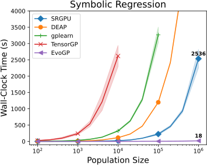
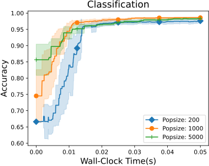
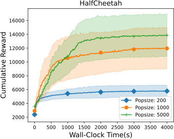
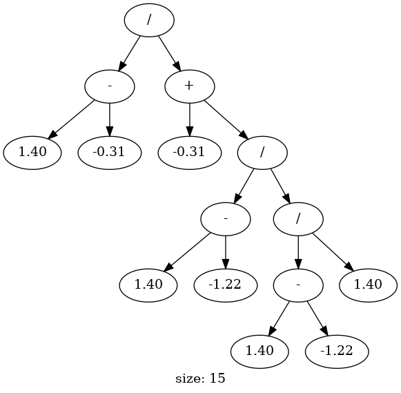

<h1 align="center">
  <a href="https://github.com/EMI-Group/evox">
  <picture>
    <source media="(prefers-color-scheme: dark)" srcset="./imgs/evox_logo_dark.png">
    <source media="(prefers-color-scheme: light)" srcset="./imgs/evox_logo_light.png">
      
  </picture>
  </a>
  <br>
</h1>

<p align="center">
  <picture>
    
  </picture>
  <picture>
    
  </picture>
  <picture>
    
  </picture>
</p>


<p align="center">
🌟 EvoGP: A GPU-accelerated Framework for Tree-based Genetic Programming 🌟
</p>

<p align="center">
  <a href="https://arxiv.org/abs/2501.17168">
    
  </a>
</p>

## Table of Contents
- [Installation](#installation)
- [Basic API Usage](#basic-api-usage)
- [Advanced Genetic Operations](#advanced-genetic-operations)
- [Supported Benchmarks](#supported-benchmarks)
   - [Symbolic Regression](#symbolic-regression)
   - [Classification](#classification)
   - [Transformation](#transformation)
   - [Robotics Control](#robotics-control)


## Introduction
EvoGP is a fully GPU-accelerated Tree-based Genetic Programming (TGP) framework built on PyTorch, leveraging custom CUDA kernels for core evolutionary operations like tree generation, mutation, crossover, and fitness evaluation. It supports multi-output trees and includes built-in tools for symbolic regression, policy optimization, and classification, along with standardized benchmarks for evaluation and tuning. EvoGP combines the flexibility of Python with the computational power of GPUs, making it an ideal platform for TGP research and applications.
EvoGP is a sister project of <a href="https://github.com/EMI-Group/evox">EvoX</a>.

## Key Features
- **CUDA-based parallel approach for TGP**:
  
    - Leverage specialized CUDA kernels to optimize critical TGP operations.
    - Enhance computational efficiency, especially for large populations, enabling faster execution compared to traditional TGP methods.

  
- **GPU-accelerated framework in Python**:
  
    - Integrates CUDA kernels into Python via custom operators of PyTorch, ensuring compatibility with modern computational ecosystems.
    - Achieve up to a **100x** speedup compared to existing TGP implementations while maintaining or improving solution quality.
    
- **Rich in extended content**:
  
    - Offers a range of genetic operation variants, allowing users to tailor configurations for specific tasks.
    - Supports multi-output trees, making it suitable for complex problems like classification and policy optimization.
    - Supports Symbolic Regression, Classification, and Policy Optimization (Brax) benchmarks.

## Installation

To install EvoGP, please follow the steps below:

### 1. Install NVIDIA CUDA Toolkit  
Ensure you have the NVIDIA CUDA Toolkit installed, including `nvcc`. You can download it from [NVIDIA's official website](https://developer.nvidia.com/cuda-downloads).  
- Check your CUDA version:  
   ```bash
   nvcc --version
   ```

### 2. Install a C++ Compiler  
Ensure you have a compatible C++ compiler installed:  
- **Linux/macOS:** Install GCC (9.x or later is recommended).  
   ```bash
   sudo apt install build-essential  # On Ubuntu
   gcc --version
   ```
- **Windows:** Install the **Visual C++ Build Tools**. You can download it from [this](https://visualstudio.microsoft.com/visual-cpp-build-tools/). During installation, ensure that the **C++ workload** is selected. 

### 3. Install PyTorch  
Install the version of PyTorch that matches your installed CUDA Toolkit version.  
For example, if you are using CUDA 11.8:  
   ```bash
   pip install torch torchvision torchaudio --index-url https://download.pytorch.org/whl/cu118
   ```
**Important:** Make sure to select the PyTorch version compatible with the **CUDA Toolkit** version (`nvcc -V`), not the NVIDIA driver version.  

You can find more details on the [PyTorch installation page](https://pytorch.org/get-started/locally/).

### 4. Install EvoGP  
Finally, install EvoGP:  
```bash
pip install git+https://github.com/EMI-Group/evogp.git --no-build-isolation
```
**Note:** This process might take a significant amount of time, as it includes the compilation of CUDA kernels.

### 5. Validate Installation
```python
python -m evogp.sr_test
```

## Basic API Usage

Start your journey with EvoGP in a few simple steps:

1. **Import necessary modules**:
```python
import torch
from evogp.tree import Forest, GenerateDescriptor
from evogp.algorithm import (
    GeneticProgramming,
    DefaultSelection,
    DefaultMutation,
    DefaultCrossover,
)
from evogp.problem import SymbolicRegression
from evogp.pipeline import StandardPipeline
```

2. **Define a problem (Here is Symbolic Regression with XOR-3d)**:
```python
XOR_INPUTS = torch.tensor(
    [
        [0, 0, 0],
        [0, 0, 1],
        [0, 1, 0],
        [0, 1, 1],
        [1, 0, 0],
        [1, 0, 1],
        [1, 1, 0],
        [1, 1, 1],
    ],
    dtype=torch.float,
    device="cuda",
)

XOR_OUTPUTS = torch.tensor(
    [[0], [1], [1], [0], [1], [0], [0], [1]],
    dtype=torch.float,
    device="cuda",
)

problem = SymbolicRegression(datapoints=XOR_INPUTS, labels=XOR_OUTPUTS)
```

3. **Configure the algorithm**:

```python
# create decriptor for generating new trees
descriptor = GenerateDescriptor(
    max_tree_len=32,
    input_len=problem.problem_dim,
    output_len=problem.solution_dim,
    using_funcs=["+", "-", "*", "/"],
    max_layer_cnt=4,
    const_samples=[-1, 0, 1],
)

# create the algorithm
algorithm = GeneticProgramming(
    initial_forest=Forest.random_generate(pop_size=5000, descriptor=descriptor),
    crossover=DefaultCrossover(),
    mutation=DefaultMutation(
        mutation_rate=0.2, descriptor=descriptor.update(max_layer_cnt=3)
    ),
    selection=DefaultSelection(survival_rate=0.3, elite_rate=0.01),
)
```

4. **Run!**:
```python
pipeline = StandardPipeline(
    algorithm,
    problem,
    generation_limit=100,
)

best = pipeline.run()
```
5. **Check the details for the best tree**:
   
**Predict results check**:
```
pred_res = best.forward(XOR_INPUTS)
print(pred_res)
```
Obtain output like this:
```
tensor([[ 1.0000e-09],
        [ 1.0000e+00],
        [ 1.0000e+00],
        [-1.0000e-09],
        [ 1.0000e+00],
        [ 1.0000e-09],
        [ 1.0000e-09],
        [ 1.0000e+00]], device='cuda:0')
```


**Mathmatics Formula (Sympy expression)**:
```python
sympy_expression = best.to_sympy_expr()
print(sympy_expression)
```
Obtain output like this:
```
(-x2*(x0 + x1) + 1.0)*(1.0*x2*(-x2*(x0 + x1) + 1.0) + (x0 - x1)**2)
```


**Visualize**:
```python
best.to_png("./imgs/xor_tree.png")
```
Obtain:




The complete code is available in [code](https://github.com/EMI-Group/evogp/tree/main/example/basic.py).

## Advanced Genetic Operations
EvoGP includes multiple genetic operators, allowing users to freely assemble them to build customized TGP algorithms.

| Type       | Name                                  |
|------------|---------------------------------------|
| Selection  | [DefaultSelection](src/evogp/algorithm/selection/default.py) |
| Selection  | [RouletteSelection](src/evogp/algorithm/selection/roulette.py) |
| Selection  | [TruncationSelection](src/evogp/algorithm/selection/truncation.py) |
| Selection  | [RankSelection](src/evogp/algorithm/selection/rank.py) |
| Selection  | [TournamentSelection](src/evogp/algorithm/selection/tournament.py) |
| Crossover  | [DefaultCrossover](src/evogp/algorithm/crossover/default.py) |
| Crossover  | [DiversityCrossover](src/evogp/algorithm/crossover/diversity.py) |
| Crossover  | [LeafBiasedCrossover](src/evogp/algorithm/crossover/leaf_biased.py) |
| Mutation   | [DefaultMutation](src/evogp/algorithm/mutation/default.py) |
| Mutation   | [HoistMutation](src/evogp/algorithm/mutation/hoist.py) |
| Mutation   | [SinglePointMutation](src/evogp/algorithm/mutation/single_point.py) |
| Mutation   | [MultiPointMutation](src/evogp/algorithm/mutation/multi_point.py) |
| Mutation   | [InsertMutation](src/evogp/algorithm/mutation/insert.py) |
| Mutation   | [DeleteMutation](src/evogp/algorithm/mutation/delete.py) |
| Mutation   | [SingleConstMutation](src/evogp/algorithm/mutation/single_const.py) |
| Mutation   | [MultiConstMutation](src/evogp/algorithm/mutation/multi_const.py) |
| Mutation   | [CombinedMutation](src/evogp/algorithm/mutation/combined.py) |


## Supported Benchmarks

### Symbolic Regression

EvoGP supports symbolic regression tasks.
You can construct a `Problem` with your custom dataset:

```python
from evogp.problem import SymbolicRegression

problem = SymbolicRegression(datapoints=YOUR_DATA, labels=YOUR_LABELS)
```
Or use a predefined function to generate data:
```python
def func(x):
    val = x[0] ** 4 / (x[0] ** 4 + 1) + x[1] ** 4 / (x[1] ** 4 + 1)
    return val.reshape(-1)

problem = SymbolicRegression(
    func=func, 
    num_inputs=2, 
    num_data=20000, 
    lower_bounds=-5, 
    upper_bounds=5
)
```

------

### Classification
EvoGP supports classification tasks.
You can construct a `Problem` with your custom dataset:

```python
from evogp.problem import Classification
problem = Classification(datapoints=YOUR_DATA, labels=YOUR_LABELS)
```

Or use the provided datasets:
```python
dataset_name = ["iris", "wine", "breast_cancer", "digits"]
problem = Classification(dataset="iris")
```
------

### Transformation

EvoGP supports feature transformation tasks, allowing the generation of new features from raw data to improve model performance. You can create a `Problem` with your custom dataset:

```python
from evogp.problem import Transformation

problem = Transformation(datapoints=YOUR_DATA, labels=YOUR_LABELS)
```

Or use a built-in dataset like "diabetes":

```python
problem = Transformation(dataset="diabetes")
```

During execution, EvoGP automatically generates features optimized for correlation with the target label. These new features can then be accessed through the `new_feature` interface.

------

### Robotics Control
EvoGP supports robotics control tasks.
You can create a Brax task with the following code:
```python
from evogp.problem import BraxProblem
problem = BraxProblem("swimmer")
```
**Note:** Using `BraxProblem` requires additional installation of the [JAX](https://github.com/jax-ml/jax) and [Brax](https://github.com/google/brax) packages.

------

Once you create your problem, you can use the following code to solve them:
```python
problem = YOUR_HAVE_ALREADY_CREATED_IT

from evogp.tree import Forest, GenerateDescriptor
from evogp.algorithm import (
    GeneticProgramming,
    DefaultSelection,
    DefaultMutation,
    DefaultCrossover,
)
from evogp.pipeline import StandardPipeline

descriptor = GenerateDescriptor(
    max_tree_len=128,
    input_len=problem.problem_dim,
    output_len=problem.solution_dim,
    using_funcs=["+", "-", "*", "/"],
    max_layer_cnt=5,
    const_samples=[-1, 0, 1],
)

algorithm = GeneticProgramming(
    initial_forest=Forest.random_generate(pop_size=1000, descriptor=descriptor),
    crossover=DefaultCrossover(),
    mutation=DefaultMutation(
        mutation_rate=0.2, descriptor=descriptor.update(max_layer_cnt=3)
    ),
    selection=DefaultSelection(survival_rate=0.3, elite_rate=0.01),
)

pipeline = StandardPipeline(
    algorithm,
    problem,
    generation_limit=10,
)

pipeline.run()
```

Detailed examples for the above tasks are available in the [**examples**](https://github.com/EMI-Group/evogp/tree/main/example).

## Community & Support

EvoGP is a new project, and we will continue to maintain it in the future. We warmly welcome suggestions for improvement!
- Engage in discussions and share your experiences on [GitHub Issues](https://github.com/EMI-Group/evogp/issues).
- Join our QQ group (ID: 297969717).

## Future Work

1. Improve EvoGP documentation and tutorials.
2. Implement more GP-related algorithms, such as LGP, CGP, GEP.
3. Add more multi-output methods for EvoGP.
4. Further optimize EvoGP to increase computation speed and reduce memory usage.

We warmly welcome community developers to contribute to EvoGP and look forward to your pull requests!

## Acknowledgements

1. Thanks to John R. Koza for the [Genetic Programming (GP) algorithm](https://www.genetic-programming.com/), which provided an excellent automatic programming technique and laid the foundation for the development of EvoGP.
2. Thanks to [PyTorch](https://pytorch.org/) and [CUDA](https://developer.nvidia.com/cuda-toolkit) for providing flexible and efficient GPU-accelerated tools, which are essential for optimizing the performance of EvoGP.
3. Thanks to the following projects for their valuable contributions to GP research, which provided inspiration and guidance for EvoGP's design: [DEAP](https://github.com/DEAP/deap), [gplearn](https://github.com/trevorstephens/gplearn), [Karoo GP](https://github.com/kstaats/karoo_gp), [TensorGP](https://github.com/cdvetal/TensorGP) and [SymbolicRegressionGPU](https://github.com/RayZhhh/SymbolicRegressionGPU).
4. Thanks to [scikit-learn](https://github.com/scikit-learn/scikit-learn) and [Brax](https://github.com/google/brax) for their benchmarking frameworks, which have provided a convenient environment for performance evaluation in EvoGP.
5. Thanks to [EvoX](https://github.com/EMI-Group/evox) for providing a flexible framework that allows EvoGP to integrate with other evolutionary algorithms, expanding its potential.
